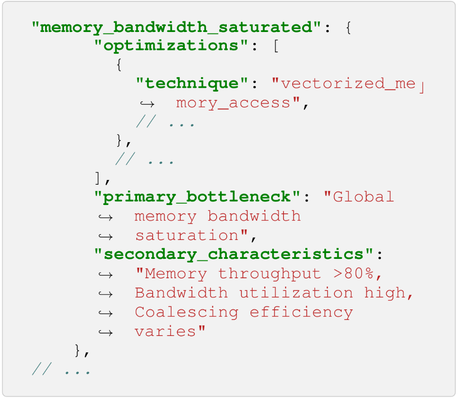
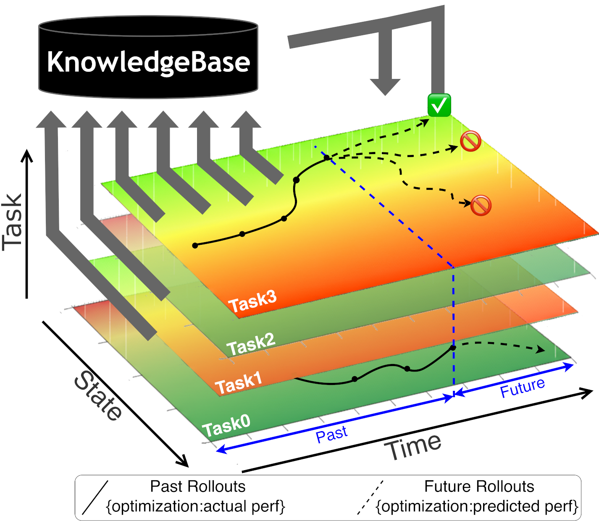
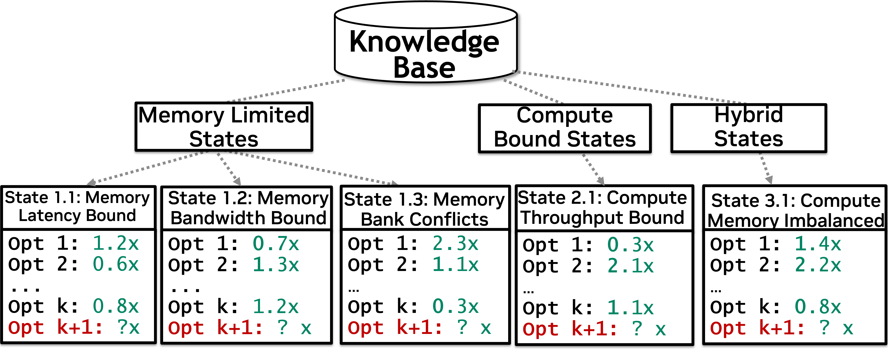
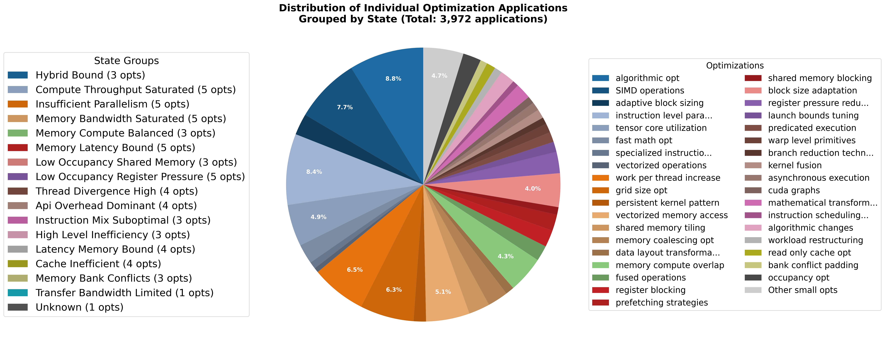

# KernelBlaster

**English** | [简体中文](README.zh-CN.md)

## Portfolio Fork Status

<!-- PORTFOLIO_STATUS:START -->
This fork has completed the Day 1–10 infrastructure, the RMSNorm deep case, manual Core 10 candidates, and a same-GPU PyTorch comparison on **NVIDIA GeForce RTX 3080 (sm_86)**. The measured environment is WSL2, CUDA 12.8.61, and driver 591.86.

| Validation item | Current status |
| --- | --- |
| CPU tests | **177 passed** on the current branch |
| CUDA build and official correctness | **historical 10/10; schema-v2 full 10/10 passed** |
| CUDA Events and same-GPU PyTorch | **schema v2 full: 4 improved, 1 no improvement, 5 inconclusive; 9/10 tasks have a stable PyTorch method** |
| External LLM smoke | **failed: current HTTP 401 (1 request, 0 retries, 0 tokens; 2026-07-22)** |
| Nsight Compute counters | **blocked: ERR_NVGPUCTRPERM (non-root Docker/WSL; one no-network SYS_ADMIN retry also blocked; Windows native control passed)** |
| Cross-GPU rerun | **blocked: requires authorized A100/L40S rental** |

| Historical v1 scope | Versus upstream (diagnostic / old strict gate) | Versus fastest PyTorch method (diagnostic / old strict gate) |
| --- | ---: | ---: |
| Nine new candidates | 5.020× / 3.302× | 1.415× / 0.931× |
| Full Core 10, including RMSNorm | 6.351× / 4.356× | 1.447× / 0.992× |

These immutable strict values remain historical v1 evidence. A separate full manual schema-v2 confirmation passed 10/10 correctness, formally confirmed 004/007/036/040, classified 088 as no improvement, and left 019/023/026/047/095 inconclusive. Under the current gate, the strict Core 10 geometric mean versus upstream is 4.381×; across the 9/10 tasks with a correct and stable PyTorch method, the strict ratio versus the fastest stable method is 1.053×. This is still not an Agent-search result. The new gate also checks p99/max error regression, NaN/Inf, and five-run determinism. Neither the Agent Pilot nor Core 10 Agent search has run.

[Schema-v2 full Core 10 validation](artifacts/portfolio-v2.0/core10/core10-rtx3080-confirmation.en.md) · [Schema-v2 full result JSON](artifacts/portfolio-v2.0/core10/core10_rtx3080_comparison.json) · [Schema-v2 targeted validation](artifacts/portfolio-v2.0/reports/rtx3080-targeted-validation.en.md) · [Schema-v2 result JSON](artifacts/portfolio-v2.0/results/rtx3080_targeted_validation.json) · [Full Chinese report](artifacts/portfolio-v1.0/reports/core10-rtx3080-comparison.zh-CN.md) · [English summary](artifacts/portfolio-v1.0/reports/core10-rtx3080-summary.en.md) · [Per-task JSON](artifacts/portfolio-v1.0/results/core10_rtx3080_comparison.json) · [Comparison figure](artifacts/portfolio-v1.0/figures/core10_rtx3080_comparison.svg) · [Raw-file hashes](artifacts/portfolio-v1.0/manifests/core10_rtx3080_raw_sha256.csv) · [Candidate manifest](portfolio/case_studies/core10/candidates.json)
<!-- PORTFOLIO_STATUS:END -->

### Reproduce the validated RTX 3080 comparison

Run these commands inside the pinned NGC 25.01 container on an `sm_86` GPU. Raw outputs remain below ignored `out/portfolio/` paths; reviewed artifacts are checked in separately.

```bash
python scripts/benchmark_candidates.py \
  --warmup 20 --repetitions 100 --sessions 5 \
  --cooldown-seconds 60 \
  --output-dir out/portfolio/candidates/<run-id>

python scripts/benchmark_pytorch.py \
  --warmup 20 --repetitions 100 --sessions 5 \
  --output-dir out/portfolio/pytorch/<run-id>

python scripts/analyze_core10_comparison.py \
  --candidate-summary out/portfolio/candidates/<run-id>/suite_summary.json \
  --pytorch-summary out/portfolio/pytorch/<run-id>/pytorch_summary.json \
  --output-dir out/portfolio/analysis/<run-id>

python -m pytest -q
python scripts/sync_portfolio_docs.py --check
```

The optimization loop performs rollout-based search and memory updates; it does not fine-tune or train the underlying language-model weights.

### Portfolio v2.1 evidence

The v2.1 publication hardens the five Issue #10 CUDA candidates without
expanding their production claim. The stable capability contract accepts only
the reviewed `sm_86`, FP16, contiguous row-major, legacy-default-stream,
single-stream, forward-only, non-graph-capture, manifest-approved cases;
unsupported requests return an explicit reason code and
`production_ready` remains `false`.

- [Evidence index and SHA-256 manifest](artifacts/portfolio-v2.1/SHA256SUMS.json)
- [Five-task correctness and lifecycle summary](artifacts/portfolio-v2.1/issue-10/rtx3080/correctness-summary.json)
- [Issue #7 API/Pilot status](artifacts/portfolio-v2.1/issue-7/rtx3080/trusted-pilot-summary.json) — HTTP 401; Pilot not run
- [Issue #8 profiler status](artifacts/portfolio-v2.1/issue-8/rtx3080/ncu-preflight-summary.json) — Windows-native NCU/NSYS evidence published; WSL counters and cross-GPU runs remain open

## Upstream Project Intro

<p><strong><span style="color:#0f766e;">Introducing KernelBlaster, a Memory-Augmented In-context Reinforcement Learning (MAIC-RL) framework</span></strong></p>

Optimizing CUDA code across multiple GPU generations is difficult because the best implementation depends on a large and hardware-specific search space. A kernel that looks reasonable on one GPU can leave performance on the table on another, and simple rewrites are rarely enough to reach the best result.

Traditional compiler pipelines are limited by fixed heuristics, while fully finetuning large language models for every optimization setting is expensive. Many agentic CUDA workflows also have a simpler problem: they do not remember enough from previous exploration. That leads to repeated mistakes, biased sampling, and weaker optimization choices.

KernelBlaster is built to make that search smarter. Instead of treating each kernel as an isolated prompt, it combines profiling feedback, a persistent CUDA optimization knowledge base, and reinforcement-learning-style exploration. The agent does not just generate code; it profiles, reflects, retrieves prior optimization knowledge, explores new candidates, and updates its strategy over time.

The result is a reusable open-source framework for CUDA optimization with verification, profiling, replay, and reproducible evaluation built in.

The upstream authors report geometric mean speedups over PyTorch of <strong><span style="color:#ef4444;">1.43x</span></strong> on KernelBench Level 1, <strong><span style="color:#2563eb;">2.50x</span></strong> on Level 2, and <strong><span style="color:#16a34a;">1.50x</span></strong> on Level 3. These paper-wide figures are background context and are separate from this fork's RTX 3080 Core 10 measurements above.

## Paper Link
**arXiv:** [**arXiv:2602.14293**](https://arxiv.org/abs/2602.14293) | **PDF:** [**KernelBlaster.pdf**](docs/figures/KernelBlaster.pdf)

## Why KernelBlaster

| Others | KernelBlaster |
| --- | --- |
| CUDA optimization is hardware-agnostic and requires searching a large design space. | KernelBlaster narrows that search with hardware-aware profiling-guided state extraction and targeted optimization selection. |
| Fixed compiler heuristics cannot easily adapt to every kernel or GPU generation. | KernelBlaster adapts optimization decisions to each kernel and GPU generation through retrieval and iterative search. |
| Finetuning LLMs for optimization is costly and slow to iterate on. | KernelBlaster improves optimization through in-context memory and RL-style exploration without depending on expensive task-specific finetuning. |
| Naive agent loops forget what they learned from earlier kernels and earlier rollouts. | KernelBlaster keeps memory in the loop through a persistent optimization database and replay-driven exploration. |

## How It Works

KernelBlaster starts from the initial KernelBench-CUDA input artifacts. Each problem provides a starter CUDA implementation in `init.cu` and a matching C++ harness in `driver.cpp`. The CUDA file is the code to optimize; the driver builds, runs, and validates the kernel against the reference behavior.

From there, the pipeline runs an agentic optimization loop:

1. Load the input problem from `data/kernelbench-cuda/<level>/<problem>/`.
2. Use `init.cu` as the starting CUDA kernel and `driver.cpp` as the validation harness.
3. Compile and profile candidate kernels, with Nsight Compute metrics and elapsed cycles as the main performance signal.
4. Retrieve relevant optimization ideas from the persistent CUDA knowledge base.
5. Generate a new candidate using profile-guided, textual-gradient-style prompts.
6. Evaluate the candidate, reward successful trajectories, and store them in the replay buffer.
7. Update future decisions using what worked, what failed, and the feedback from the profiler.
8. Save the best optimized kernel as `final_rl_cuda_perf.cu`.

In code, the default single-run path is:

- `scripts/run_single_kernelblaster.sh` starts the runtime environment and launches the RL run.
- `scripts/run_RL.py` prepares the dataset, servers, and workflow inputs.
- `src/kernelblaster/workflow/workflow.py` invokes the graph-based workflow.
- `src/kernelblaster/graph/nodes/optimization_rl_ncu.py` loads `init.cu` and `driver.cpp`, then launches the RL optimization agent.
- `src/kernelblaster/agents/opt_ncu_rl.py` runs the rollout, profiling, replay-buffer, and strategy-update loop.

<p align="center">
  
</p>

This figure shows the end-to-end optimization loop. KernelBlaster starts from the input kernel and the target GPU hardware, extracts a performance state, matches that state against the knowledge base, selects a promising optimization, lowers it into code, tests correctness, profiles the result, and repeats until the termination check decides that the search has converged. The final stage uses LLM soft verification before writing the optimized output kernel.

## Quick Start

### Recommended: Docker Desktop + WSL2

Keep the repository and active experiment data in the Ubuntu ext4 filesystem.
Windows provides the NVIDIA driver, WSL, Docker Desktop, and the editor; the
project containers provide CUDA 12.8, `nvcc`, PyTorch, and Python dependencies.
Do not install a second Docker Engine or Linux NVIDIA display driver inside
Ubuntu.

From a normal clone such as `~/workspace/KernelBlaster`, prepare the external
persistent directories and the control-only secret file:

```bash
mkdir -p ../../{datasets,checkpoints,runs}/KernelBlaster
mkdir -p ../../runs/KernelBlaster/state
mkdir -p ../../caches/{huggingface,torch,triton} ../../secrets
cp -n .env.example ../../secrets/KernelBlaster.control.env
# Edit ../../secrets/KernelBlaster.control.env locally; never commit it.
```

The root `compose.yaml` is the only deployment specification. Point Compose at
the external file and configure distinct control, worker-callback,
supervisor-submit, and profiler token audiences:

```bash
export KERNELBLASTER_CONTROL_ENV_FILE="$HOME/secrets/KernelBlaster.control.env"
export KERNELBLASTER_STATE_HOST_DIR="$HOME/runs/KernelBlaster/state"
# The external file supplies all four token variables; they must be distinct.
docker compose --env-file "$KERNELBLASTER_CONTROL_ENV_FILE" config
docker compose --env-file "$KERNELBLASTER_CONTROL_ENV_FILE" build control gpu-supervisor profiler-worker
docker compose --env-file "$KERNELBLASTER_CONTROL_ENV_FILE" up --wait

# Verify health and the non-interchangeable token audiences, then clean up.
docker compose --env-file "$KERNELBLASTER_CONTROL_ENV_FILE" --profile smoke run --rm smoke
docker compose --env-file "$KERNELBLASTER_CONTROL_ENV_FILE" down --remove-orphans

# The trusted interactive CUDA development environment is opt-in.
docker compose --env-file "$KERNELBLASTER_CONTROL_ENV_FILE" --profile dev run --rm dev \
  bash scripts/run-with-metadata.sh python -m pytest -q
```

| Ubuntu path | Container path | Default access |
| --- | --- | --- |
| repository | `/workspace` | read/write |
| `~/datasets/KernelBlaster` | `/data` | read-only |
| `~/checkpoints/KernelBlaster` | `/checkpoints` | read/write |
| `~/runs/KernelBlaster` | `/runs` | read/write |
| `~/runs/KernelBlaster/state` | `/state` in `control` only | read/write, SQLite/CAS |
| `~/caches/{huggingface,torch,triton}` | `/cache/...` | read/write |
| `~/secrets/KernelBlaster.control.env` | injected into `control` only | never copied into an image |

`control` is a CPU-only Python image bound only to `127.0.0.1:8000`; it is the
sole container that receives LLM provider configuration. `gpu-supervisor`
uses the pinned CUDA image, runs as UID 10001 with a read-only root filesystem,
dropped capabilities, `no-new-privileges`, bounded memory/PIDs, and only the
internal `worker-plane` network. It receives worker-callback and
supervisor-submit credentials, never an LLM key or control token. No credential
is forwarded to compile/correctness/Events subprocesses. When generated jobs
are enabled, this trusted service alone receives the Docker socket; the Job
container never receives it. The `dev` profile remains the trusted place for
`nvcc`, tests, and interactive debugging.

### Hardware-portable GPU Job protocol

Control submits strict `gpu-job/v1` manifests containing only CAS digests,
stage, target architecture, protocol ID, bounded resources, and a deadline.
The GPU Supervisor reports its actual device through `/v1/capabilities`; GPU
product names are descriptive, while the detected compute capability is the
source of truth. Local RTX 3080 validation therefore reports `sm_86`, but A100,
L40S/RTX 4090, and H100 deployments use `sm_80`, `sm_89`, and `sm_90` without
changing the API schema.

PR 04 keeps single-GPU concurrency at one and disables generated-code jobs by
default. Only source bundle digests listed in
`portfolio/trusted-gpu-bundles.json` can reach the fixed compile/correctness/
Events executor. The legacy arbitrary binary endpoint is not started by the
default Supervisor process, and Control no longer starts local CompileServer or
GPU Server processes.

### Ephemeral generated-candidate sandbox

Generated code remains disabled until a local immutable Job image and a
Supervisor-only private evaluation profile are configured. Build the dedicated
image, pin its inspected digest (never a tag), set the Docker socket group from
the Linux/AutoDL host, and then enable the flag:

```bash
docker compose --env-file "$KERNELBLASTER_CONTROL_ENV_FILE" --profile build build gpu-job-image
export KERNELBLASTER_GPU_JOB_IMAGE="$(docker image inspect --format '{{.Id}}' local/kernelblaster-gpu-job:cuda12.8-dev)"
export KERNELBLASTER_DOCKER_GID="$(stat -c '%g' /var/run/docker.sock)"
export KERNELBLASTER_PRIVATE_EVALUATION_PROFILES_HOST="$HOME/secrets/private-evaluation-profiles.json"
export KERNELBLASTER_ENABLE_GENERATED_GPU_JOBS=true
```

The private manifest maps a public `private_evaluation_profile_id` to a CAS
bundle and driver path. It is mounted read-only only in the Supervisor; driver
and seed contents are not part of a generated manifest, LLM prompt, or public
feedback payload. Each generated compile, correctness, and Events stage runs in
a newly created non-root container with a read-only root filesystem, no network,
no capabilities, a read-only per-Job input volume, and a 512 MiB tmpfs. The
fixed limits are 2 vCPU, 8 GiB RAM, 64 PIDs, and 180/60/90 seconds respectively.
The Supervisor imports only hash-verified allowlisted files and removes the Job
container and staging volume on every exit path. Docker/GPU attack probes are
marked `gpu_sandbox` and must run on an AutoDL or self-hosted GPU runner.

### Independent fixed-plan Profiler Worker

`profiler-worker` is a separate token audience and network boundary. Control
routes only correctness-passed executable artifact digests, one of the fixed
plan IDs below, a bounded kernel filter, and a deadline; executable paths,
arbitrary argv, environment dictionaries, and caller-selected output paths are
rejected by the schema.

- `nsys_timeline_v1`: CUDA/NVTX trace, CPU sampling disabled; WSL may make one
  controlled retry with NVIDIA's `CuptiUseRawGpuTimestamps=false` configuration
  in the Job's temporary HOME when the first report has no GPU rows.
- `ncu_triage_v1`: SpeedOfLight, LaunchStats, and Occupancy.
- `ncu_memory_v1`: MemoryWorkloadAnalysis.
- `ncu_scheduler_v1`: SchedulerStats and WarpStateStats.

CUDA Events remain the ranking source. NSYS/NCU summaries are marked
`diagnostic_only`; raw report, CSV, and tool logs are stored in CAS and are
never copied into an LLM prompt. On startup, `KERNELBLASTER_NCU_PREFLIGHT_STATUS=auto`
runs a fixed, bounded kernel under NCU and advertises NCU plans only when a real
counter report is created. The Profiler process drops to UID 10002 with an
effective and bounding capability set containing only `SYS_ADMIN`; Control,
Supervisor, and generated Jobs never receive that capability. Windows native
profiling remains a manually approved Top-K diagnostic and is not automated by
this service.

WSL counter access is also gated by the Windows NVIDIA driver. In NVIDIA Control
Panel, enable Developer Settings and set **Manage GPU Performance Counters** to
allow access for all users, then restart WSL and Docker Desktop. Keep the status
at `auto`; do not force `available`. NVIDIA documents this host requirement in
the [Nsight Compute profiling guide](https://developer.nvidia.com/ERR_NVGPUCTRPERM).

Register the reviewed vector-add smoke inputs in the local CAS before the first
Supervisor smoke run:

```bash
python scripts/register_trusted_gpu_smoke.py \
  --state-dir "$KERNELBLASTER_STATE_HOST_DIR"
```

The script verifies the deterministic bundle and driver digests against the
checked-in allowlist before writing either payload.

With Control and the GPU Supervisor running, exercise the complete digest-only
compile → correctness → Events chain:

```bash
python scripts/run_trusted_gpu_smoke.py
```

After changing the Windows counter setting, recreate the Profiler Worker and
run the complete Events → NSYS → NCU triage smoke. A blocked or incomplete
profile makes the command fail instead of silently downgrading the result:

```bash
docker compose --env-file "$KERNELBLASTER_CONTROL_ENV_FILE" \
  up -d --wait --force-recreate profiler-worker control
python scripts/run_trusted_gpu_smoke.py \
  --profile-plan nsys_timeline_v1 \
  --profile-plan ncu_triage_v1
```

### Durable local state and experiment memory

The control service owns a local SQLite task database and a SHA-256
content-addressed store (CAS) under `KERNELBLASTER_STATE_HOST_DIR`. Keep this
directory on WSL ext4 or an AutoDL local disk: the service rejects known NFS,
SMB/CIFS, and `drvfs` mounts. The GPU supervisor never mounts it and never
opens SQLite directly; it receives leases and reports results through the
authenticated Control API.

SQLite stores run/job status, leases, attempts, and small metadata. Source
files, logs, profiles, and reports are immutable CAS payloads referenced by
digest. This is durable, auditable experiment memory for a later retrieval
layer; it is not an embedding database or RAG implementation by itself.

For an existing state database, stop Control before a migration and make an
explicit local backup:

```bash
cp "$KERNELBLASTER_STATE_HOST_DIR/control.sqlite3" \
  "$KERNELBLASTER_STATE_HOST_DIR/control.sqlite3.backup-$(date -u +%Y%m%dT%H%M%SZ)"
```

The control process applies forward-only migrations at startup. For local CLI
runs, `--state-dir`, `--sqlite-path`, and `--cas-dir` override the matching
`KERNELBLASTER_*` environment variables; this permits an explicit AutoDL path
without hardcoding a machine-specific location.

The ordinary Events path does not require host networking, `--privileged`, or
`SYS_ADMIN`. If local NCU counters remain unavailable, the run is recorded as
`events_only`; deploy an explicitly authorized profiler worker instead of
raising privileges on the control container.

`docker/compose.worker.yml` is a deprecated compatibility wrapper around the
root Compose file. Do not add a second deployment definition there.

#### Set your API key and run the default example

```bash
export OPENAI_API_KEY=<your_api_key>
export MODEL=${MODEL:-gpt-5-mini-2025-08-07}
export GPU_TYPE=${GPU_TYPE:-L40S}
export DATASET=${DATASET:-kernelbench-cuda}
export EXPERIMENT_NAME=${EXPERIMENT_NAME:-timing_analysis}
export RL_EXPERIMENT_NAME=${RL_EXPERIMENT_NAME:-kernelblaster}

bash scripts/run_single_kernelblaster.sh
```

For the bounded research acceptance sequence, use
`python scripts/run_trusted_pilot.py`. It enforces runtime → compile/correctness
→ three-session Events → NCU permission probe → one 64-token API smoke → the
2×2 RMSNorm Pilot, stopping immediately when a required gate fails.

By default, `scripts/run_single_kernelblaster.sh` launches a single KernelBench-CUDA RL optimization run with CUDA Events profiling, starts the loopback-only shared GPU server if needed, and writes outputs under `out/<dataset>/<precision>/<experiment>/`.

Note that this example runs a single sample from the Level 1 KernelBench-CUDA dataset. This can be extended by passing additional problems via the `--problem-numbers` flag and the `--subset` flag.

```bash
bash scripts/run_single_kernelblaster.sh --problem-numbers 1-10 --subset level2
```

#### 4. What to expect

- Input kernels come from `data/kernelbench-cuda/`.
- The default script runs a Level 1 problem and performs RL-based CUDA optimization.
- Trajectory artifacts, prompts, logs, and best outputs will be tracked in the run's `out` directory.
- The best optimized kernel is written as `final_rl_cuda_perf.cu`.
- The trained optimization database will be tracked in the run's `out` directory, as `optimization_database.json`.

#### 5. Reproduce PyTorch baseline

To compare/reproduce the speedup KernelBlaster made, run the PyTorch baseline runner `scripts/run_baselines.py` (testing on Torch Eager) and `scripts/run_baselines_compile.py` (testing on Torch Compile) on the benchmark problems.

Before running, clone KernelBench under `data/` 

```bash
git clone https://github.com/ScalingIntelligence/KernelBench.git data/KernelBench
```

It walks a root directory looking for `problem.py` files, imports each problem module dynamically, builds the `Model`, gets init args and inputs from `get_init_inputs()` / `get_inputs()`, moves them to CPU or CUDA, runs warmup + timed forward passes, and reports latency statistics. In NCU mode it instead launches Nsight Compute on each problem and reports either Elapsed Cycles or another raw metric.

```bash
# Torch Eager baseline
python scripts/run_baselines.py --root data/KernelBench/KernelBench/level1 --device cuda

# torch.compile baseline
python scripts/run_baselines_compile.py --root data/KernelBench/KernelBench/level1 --device cuda

# Nsight Compute (NCU) mode (reports Elapsed Cycles by default)
python scripts/run_baselines.py --root data/KernelBench/KernelBench/level1 --device cuda --ncu
```

## Repo Overview

```text
KernelBlaster/
|-- compose.yaml
|-- data/
|   |-- kernelbench-cuda/
|   |   |-- level1/
|   |   |-- level2/
|   |   `-- level3/
|   `-- kernelblaster/
|       |-- optimization_database.json
|       |-- optimization_database_header.md
|       `-- optimization_database_footer.md
|-- docker/
|   `-- Dockerfile
|-- portfolio/
|   |-- status.json
|   |-- suites/
|   `-- case_studies/
|       |-- core10/
|       `-- rmsnorm/
|-- artifacts/
|   |-- portfolio-v1.0/
|   |-- portfolio-v2.0/
|   `-- portfolio-v2.1/
|-- scripts/
|   |-- container.sh
|   |-- run-with-metadata.sh
|   |-- benchmark_cuda.py
|   |-- benchmark_candidates.py
|   |-- benchmark_pytorch.py
|   |-- analyze_core10_comparison.py
|   |-- sync_portfolio_docs.py
|   |-- run_single_kernelblaster.sh
|   |-- run_RL.py
|   |-- run_baselines.py
|   |-- run_baselines_compile.py
|   |-- run_reprofile.py
|   `-- start_gpu_server.py
|-- src/kernelblaster/
|   |-- agents/
|   |-- config/
|   |-- graph/
|   |-- resources/
|   |-- servers/
|   `-- workflow/
`-- utils/
```

### Key folders

- `data/kernelbench-cuda/`: curated KernelBench-CUDA tasks, each with `init.cu` and `driver.cpp`.
- `data/kernelblaster/`: optimization database assets and curated optimization knowledge.
- `portfolio/`: the living status manifest, reproducible suites, committed candidates, and deep case studies.
- `artifacts/portfolio-v1.0/`: immutable historical environment, result, report, figure, and SHA256 publication bundle.
- `artifacts/portfolio-v2.0/`: schema-v2 Core 10 confirmation and targeted validation evidence.
- `artifacts/portfolio-v2.1/`: hardened Issue evidence, compact NCU/NSYS reports, and the generated SHA-256 index.
- `scripts/`: Agent entrypoints plus correctness-first CUDA, PyTorch, analysis, and documentation-sync runners.
- `docs/portfolio/`: architecture, validation status, deep-case evidence, and bilingual progress navigation.
- `src/kernelblaster/agents/`: the optimization agents, replay components, database logic, and profiling utilities.
- `src/kernelblaster/graph/`: workflow graph nodes and shared state definitions.
- `src/kernelblaster/servers/`: compiler and GPU server infrastructure used during optimization.
- `src/kernelblaster/workflow/`: top-level workflow execution.


### CUDA Knowledge Base data structure 

<p align="center">
  
</p>

The knowledge base stores optimization experience in a structured state-centered form. Each state captures a bottleneck pattern, the primary performance issue, the secondary characteristics that identify it, and the optimizations that have been effective for similar kernels. This is what lets KernelBlaster reuse prior search experience instead of starting every task from scratch.

### State groups and optimization choices

<p align="center">
  
</p>

This figure illustrates how the knowledge base is organized around state families such as memory-limited, compute-bound, and hybrid states. Within each state, KernelBlaster tracks how different optimization techniques performed before, which helps it bias future search toward strategies with better expected payoff while still leaving room to explore.

### Memory across tasks and rollouts

<p align="center">
  
</p>

This figure explains the memory-augmented part of MAIC-RL. Past rollouts from earlier tasks are stored in the knowledge base as actual measured performance. When KernelBlaster faces a new state in a future rollout, it uses those past results to steer the search toward higher-value regions of the optimization space and away from paths that previously underperformed.

### Optimization diversity across states

<p align="center">
  
</p>

This figure shows the breadth of the optimization space covered by the framework. Different state groups call for different techniques, including vectorized memory access, tensor core utilization, work-per-thread tuning, shared-memory tiling, kernel fusion, occupancy tuning, and several smaller specialized transformations. That diversity is important because no single optimization strategy dominates across all CUDA kernels.

Further, this Knowledge Base can be found in `KernelBlaster/data/kernelblaster/optimization_database.json` and serves as a guide for general performance engineering agents or can be used as labeled training data for model training.
## Contributors

[Kris Shengjun Dong](https://people.eecs.berkeley.edu/~chrisdong/), [Sahil Modi](https://www.linkedin.com/in/sahil-modi), [Dima Nikiforov](https://www.linkedin.com/in/dima-n/), [Sana Damani](https://sanadamani.com/), Edward Lin, [Siva Kumar Sastry Hari](https://sivahari.github.io/), [Christos Kozyrakis](https://web.stanford.edu/~kozyraki/)

Most of this work was done by Kris Shengjun Dong during her 2025 summer internship at NVIDIA.


If you use KernelBlaster, please cite:

```bibtex
@article{dong2026kernelblaster,
  title={KernelBlaster: Continual Cross-Task CUDA Optimization via Memory-Augmented In-Context Reinforcement Learning},
  author={Dong, Kris Shengjun and Modi, Sahil and Nikiforov, Dima and Damani, Sana and Lin, Edward and Hari, Siva Kumar Sastry and Kozyrakis, Christos},
  journal={arXiv preprint arXiv:2602.14293},
  year={2026}
}
```
