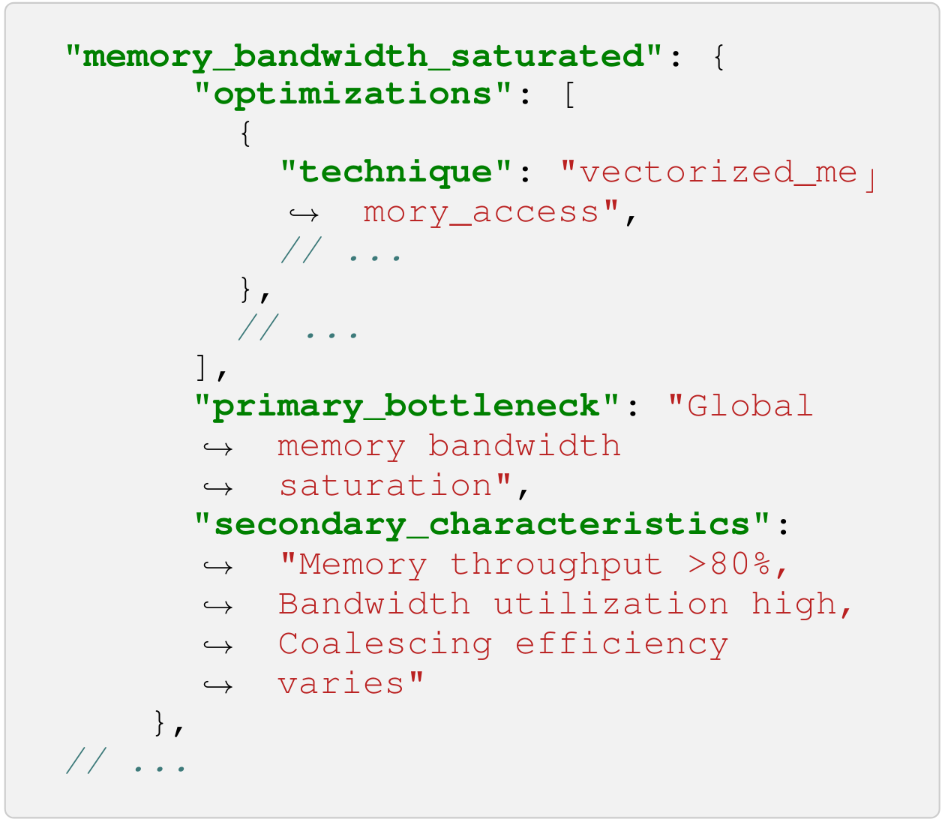
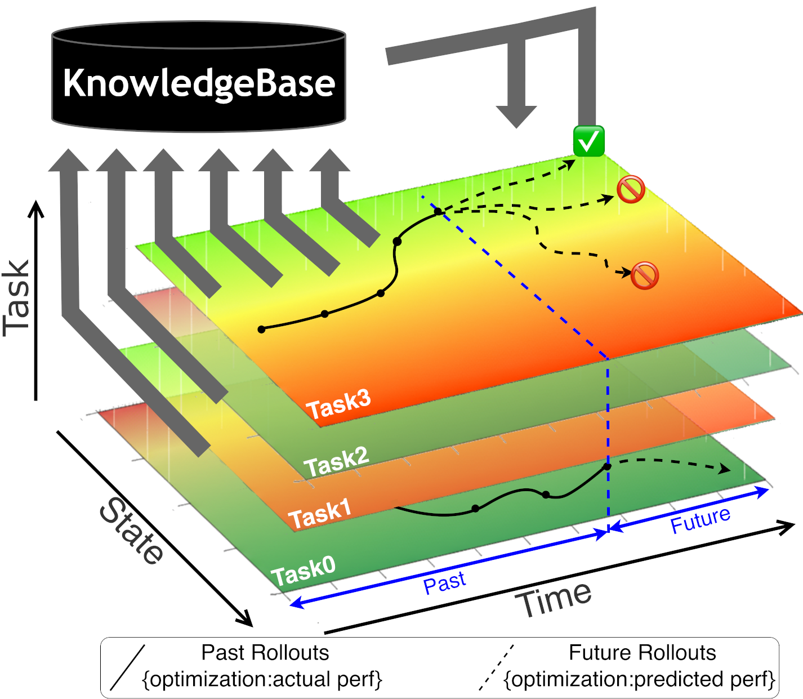
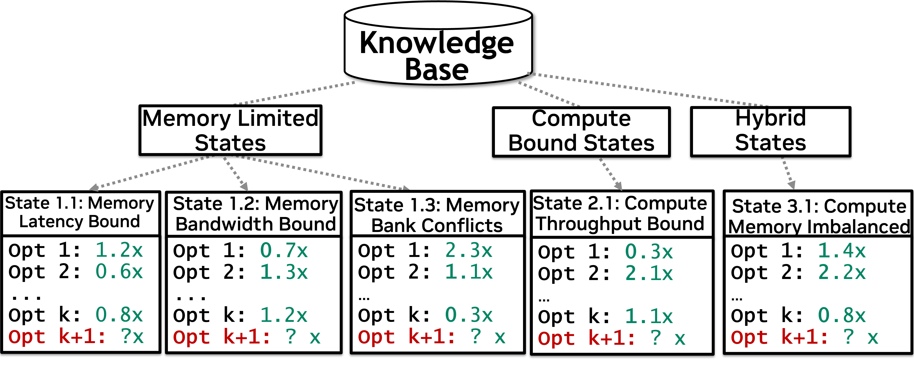
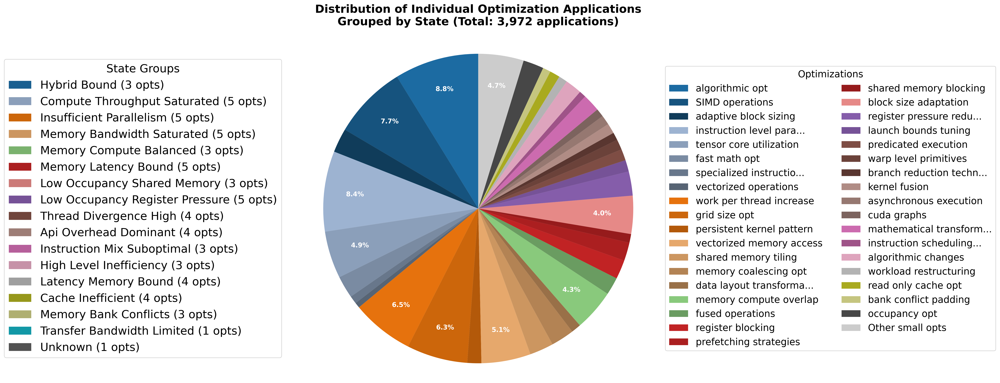

# KernelBlaster

[English](README.md) | **简体中文**

## Portfolio Fork 状态

<!-- PORTFOLIO_STATUS:START -->
当前 Fork 已在 **NVIDIA GeForce RTX 3080（sm_86）** 上完成 Day 1–10 基础设施、RMSNorm 深度案例、Core 10 手工候选和同卡 PyTorch 对比。环境为 WSL2、CUDA 12.8.61、驱动 591.86。

| 验证项目 | 当前状态 |
| --- | --- |
| CPU 测试 | **52 项通过**（已发布实验批次） |
| CUDA 编译与官方正确性 | **通过；10/10 个候选通过** |
| CUDA Events 与同卡 PyTorch | **已完成；20 次预热 / 100 个样本 / 3 个独立进程 Session** |
| 外部 LLM 冒烟测试 | **阻塞：HTTP 401 invalid_api_key；不重试** |
| Nsight Compute 硬件计数器 | **阻塞：ERR_NVGPUCTRPERM** |
| 跨 GPU 复测 | **未运行（Day 11–14 不在本阶段范围）** |

| 实测范围 | 相对仓库原版（诊断 / 严格） | 相对 PyTorch 最快方法（诊断 / 严格） |
| --- | ---: | ---: |
| 本轮新增九题 | 5.020× / 3.302× | 1.415× / 0.931× |
| 完整 Core 10（含 RMSNorm） | 6.351× / 4.356× | 1.447× / 0.992× |

严格口径要求正确、跨 Session 稳定、每个 Session 不退化且提升至少 1.01×；未通过的任务按仓库原版 1.0 计入分母。九题有 3/9 个正式提升，完整 Core 10 有 4/10 个正式提升。LLM Agent 搜索仍因 401 未运行，这些结果来自可审计的手工候选，不与上游论文数据混用。

[中文完整报告](artifacts/portfolio-v1.0/reports/core10-rtx3080-comparison.zh-CN.md) · [英文摘要](artifacts/portfolio-v1.0/reports/core10-rtx3080-summary.en.md) · [逐题 JSON](artifacts/portfolio-v1.0/results/core10_rtx3080_comparison.json) · [对比图](artifacts/portfolio-v1.0/figures/core10_rtx3080_comparison.svg) · [原始文件哈希](artifacts/portfolio-v1.0/manifests/core10_rtx3080_raw_sha256.csv) · [候选清单](portfolio/case_studies/core10/candidates.json) · [Draft PR #5](https://github.com/shunwendongan/KernelBlaster/pull/5)
<!-- PORTFOLIO_STATUS:END -->

### 复现 RTX 3080 正式对比

以下命令应在固定的 NGC 25.01 容器和 `sm_86` GPU 中执行。原始输出保存在被忽略的 `out/portfolio/`，审核后的结果单独提交。

```bash
python scripts/benchmark_candidates.py \
  --warmup 20 --repetitions 100 --sessions 3 \
  --cooldown-seconds 60 \
  --output-dir out/portfolio/candidates/<run-id>

python scripts/benchmark_pytorch.py \
  --warmup 20 --repetitions 100 --sessions 3 \
  --output-dir out/portfolio/pytorch/<run-id>

python scripts/analyze_core10_comparison.py \
  --candidate-summary out/portfolio/candidates/<run-id>/suite_summary.json \
  --pytorch-summary out/portfolio/pytorch/<run-id>/pytorch_summary.json \
  --output-dir out/portfolio/analysis/<run-id>

python -m pytest -q
python scripts/sync_portfolio_docs.py --check
```

这里的优化循环执行的是基于 rollout 的搜索和经验库更新，不会微调或训练底层大语言模型的权重。

## 上游项目介绍

<p><strong><span style="color:#0f766e;">KernelBlaster 是一个基于记忆增强上下文强化学习（Memory-Augmented In-context Reinforcement Learning，MAIC-RL）的框架</span></strong></p>

在不同代 GPU 上优化 CUDA 代码并不容易，因为最佳实现取决于庞大且高度硬件相关的搜索空间。一个在某张 GPU 上看起来合理的 Kernel，换到另一张 GPU 上可能仍会浪费大量性能，而简单改写通常不足以得到最佳结果。

传统编译器流水线受限于固定启发式规则；针对每种优化场景完整微调大语言模型又十分昂贵。许多 CUDA Agent 工作流还存在一个更直接的问题：它们无法充分记住此前探索得到的经验，因而容易重复犯错、产生有偏采样，并做出较弱的优化选择。

KernelBlaster 旨在让这一搜索过程更加智能。它不会把每个 Kernel 当作相互孤立的 Prompt，而是结合性能分析反馈、持久化 CUDA 优化知识库，以及类似强化学习的探索过程。Agent 不只是生成代码，还会执行性能分析、反思、检索既有优化知识、探索新候选，并持续更新搜索策略。

最终得到的是一个可复用的开源 CUDA 优化框架，内置正确性验证、性能分析、经验回放和可复现实验评估能力。

根据上游作者报告，与 PyTorch 基线相比，KernelBlaster 在 KernelBench Level 1、Level 2 和 Level 3 上分别取得了 <strong><span style="color:#ef4444;">1.43x</span></strong>、<strong><span style="color:#2563eb;">2.50x</span></strong> 和 <strong><span style="color:#16a34a;">1.50x</span></strong> 的几何平均加速。这些论文全量数据仅作为背景，与上方本 Fork 的 RTX 3080 Core 10 实测严格分开。

## 论文链接

**arXiv：** [**arXiv:2602.14293**](https://arxiv.org/abs/2602.14293) | **PDF：** [**KernelBlaster.pdf**](docs/figures/KernelBlaster.pdf)

## 为什么使用 KernelBlaster

| 其他方法的局限 | KernelBlaster 的设计 |
| --- | --- |
| CUDA 优化往往缺乏硬件针对性，并需要搜索巨大的设计空间。 | KernelBlaster 通过硬件感知、性能分析引导的状态提取与定向优化选择来缩小搜索空间。 |
| 固定编译器启发式难以适应每个 Kernel 和每一代 GPU。 | KernelBlaster 通过检索与迭代搜索，让优化决策适应具体 Kernel 和 GPU 架构。 |
| 为每个优化任务微调 LLM 成本高、迭代慢。 | KernelBlaster 使用上下文记忆与类似 RL 的探索改进优化，不依赖昂贵的任务专用微调。 |
| 朴素 Agent 循环容易遗忘之前任务和 rollout 的经验。 | KernelBlaster 通过持久化优化数据库和经验回放复用既有经验。 |

## 工作原理

KernelBlaster 从 KernelBench-CUDA 的初始输入产物开始工作。每个问题都提供一个起始 CUDA 实现 `init.cu` 和配套的 C++ 测试程序 `driver.cpp`。CUDA 文件是待优化代码，Driver 负责编译、运行，并根据参考行为验证 Kernel。

随后，系统执行 Agent 优化循环：

1. 从 `data/kernelbench-cuda/<level>/<problem>/` 加载输入问题。
2. 使用 `init.cu` 作为起始 CUDA Kernel，使用 `driver.cpp` 作为验证程序。
3. 编译并分析候选 Kernel，以 Nsight Compute 指标和 Elapsed Cycles 作为主要性能信号。
4. 从持久化 CUDA 知识库中检索相关优化思路。
5. 使用性能分析引导、类似文本梯度的 Prompt 生成新候选。
6. 评估候选，对成功轨迹给予奖励，并将其写入经验回放缓冲区。
7. 根据有效方案、失败方案和 Profiler 反馈更新后续决策。
8. 将最佳优化 Kernel 保存为 `final_rl_cuda_perf.cu`。

代码中的默认单次运行链路如下：

- `scripts/run_single_kernelblaster.sh` 启动运行环境并发起 RL 运行。
- `scripts/run_RL.py` 准备数据集、服务和工作流输入。
- `src/kernelblaster/workflow/workflow.py` 调用基于 Graph 的工作流。
- `src/kernelblaster/graph/nodes/optimization_rl_ncu.py` 加载 `init.cu` 和 `driver.cpp`，然后启动 RL 优化 Agent。
- `src/kernelblaster/agents/opt_ncu_rl.py` 执行 rollout、性能分析、经验回放缓冲区和策略更新循环。

<p align="center">
  
</p>

上图展示了端到端优化循环。KernelBlaster 从输入 Kernel 和目标 GPU 硬件出发，提取性能状态，在知识库中匹配相应状态，选择有潜力的优化，将其转换成代码，执行正确性测试和性能分析，并持续迭代，直到终止条件判定搜索已收敛。最后阶段使用 LLM 软验证，然后写出优化后的 Kernel。

## 快速开始

### 1. 构建容器

```bash
docker build . -t kernelblaster -f docker/Dockerfile
```

### 2. 启动容器

```bash
docker run --rm -it --name=kernelblaster \
    --privileged --gpus all --cap-add=SYS_ADMIN --device /dev/fuse \
    --ulimit memlock=-1 --ulimit stack=67108864 \
    --ipc=host --net=host \
    -e USER_NAME=$(whoami) \
    -e USER_ID=$(id -u) \
    -e GROUP_ID=$(id -g) \
    -v $(pwd):/kernelblaster \
    kernelblaster \
    dev
```

### 3. 设置 API Key 并运行默认示例

```bash
export OPENAI_API_KEY=<your_api_key>
export MODEL=${MODEL:-gpt-5-mini-2025-08-07}
export GPU_TYPE=${GPU_TYPE:-L40S}
export DATASET=${DATASET:-kernelbench-cuda}
export EXPERIMENT_NAME=${EXPERIMENT_NAME:-timing_analysis}
export RL_EXPERIMENT_NAME=${RL_EXPERIMENT_NAME:-kernelblaster}

bash scripts/run_single_kernelblaster.sh
```

默认情况下，`scripts/run_single_kernelblaster.sh` 会启动单个 KernelBench-CUDA RL 优化任务并启用性能分析；如有需要，它还会启动共享 GPU Server。运行输出保存在 `out/<dataset>/<precision>/<experiment>/` 下。

该示例默认运行 KernelBench-CUDA Level 1 的一个样本。可以通过 `--problem-numbers` 和 `--subset` 参数扩展到更多问题：

```bash
bash scripts/run_single_kernelblaster.sh --problem-numbers 1-10 --subset level2
```

### 4. 运行产物

- 输入 Kernel 来自 `data/kernelbench-cuda/`。
- 默认脚本运行一个 Level 1 问题，并执行基于 RL 的 CUDA 优化。
- 轨迹产物、Prompt、日志和最佳输出保存在运行目录的 `out` 下。
- 最佳优化 Kernel 写入 `final_rl_cuda_perf.cu`。
- 经 rollout 搜索更新的优化数据库写入运行目录中的 `optimization_database.json`。

### 5. 复现 PyTorch 基线

如需比较或复现上游 KernelBlaster 的加速效果，可在 Benchmark 问题上运行 `scripts/run_baselines.py`（Torch Eager）和 `scripts/run_baselines_compile.py`（Torch Compile）。

首先将 KernelBench Clone 到 `data/`：

```bash
git clone https://github.com/ScalingIntelligence/KernelBench.git data/KernelBench
```

Baseline Runner 会在根目录下查找 `problem.py`，动态导入问题模块，构建 `Model`，通过 `get_init_inputs()` 和 `get_inputs()` 获取输入，将模型和数据移动到 CPU 或 CUDA，执行预热和计时，并报告延迟统计。在 NCU 模式下，它会启动 Nsight Compute，并报告 Elapsed Cycles 或指定的其他原始指标。

```bash
# Torch Eager 基线
python scripts/run_baselines.py --root data/KernelBench/KernelBench/level1 --device cuda

# torch.compile 基线
python scripts/run_baselines_compile.py --root data/KernelBench/KernelBench/level1 --device cuda

# Nsight Compute（NCU）模式，默认报告 Elapsed Cycles
python scripts/run_baselines.py --root data/KernelBench/KernelBench/level1 --device cuda --ncu
```

## 仓库结构

```text
KernelBlaster/
|-- data/
|   |-- kernelbench-cuda/
|   |   |-- level1/
|   |   |-- level2/
|   |   `-- level3/
|   `-- kernelblaster/
|       |-- optimization_database.json
|       |-- optimization_database_header.md
|       `-- optimization_database_footer.md
|-- docker/
|   `-- Dockerfile
|-- portfolio/
|   |-- status.json
|   |-- suites/
|   `-- case_studies/
|       |-- core10/
|       `-- rmsnorm/
|-- artifacts/
|   `-- portfolio-v1.0/
|-- scripts/
|   |-- benchmark_cuda.py
|   |-- benchmark_candidates.py
|   |-- benchmark_pytorch.py
|   |-- analyze_core10_comparison.py
|   |-- sync_portfolio_docs.py
|   |-- run_single_kernelblaster.sh
|   |-- run_RL.py
|   |-- run_baselines.py
|   |-- run_baselines_compile.py
|   |-- run_reprofile.py
|   `-- start_gpu_server.py
|-- src/kernelblaster/
|   |-- agents/
|   |-- config/
|   |-- graph/
|   |-- resources/
|   |-- servers/
|   `-- workflow/
`-- utils/
```

### 关键目录

- `data/kernelbench-cuda/`：整理后的 KernelBench-CUDA 任务，每个任务包含 `init.cu` 和 `driver.cpp`。
- `data/kernelblaster/`：优化数据库和整理后的优化知识。
- `portfolio/`：实时状态清单、可复现 Suite、已提交候选和深度案例。
- `artifacts/portfolio-v1.0/`：脱敏环境、结果、报告、图表与 SHA256 发布包。
- `scripts/`：Agent 入口，以及正确性优先的 CUDA、PyTorch、分析和文档同步 Runner。
- `docs/portfolio/`：架构、验证状态、深度案例证据和双语进度导航。
- `src/kernelblaster/agents/`：优化 Agent、经验回放组件、数据库逻辑和性能分析工具。
- `src/kernelblaster/graph/`：工作流 Graph Node 和共享状态定义。
- `src/kernelblaster/servers/`：优化过程中使用的编译和 GPU Server 基础设施。
- `src/kernelblaster/workflow/`：顶层工作流执行逻辑。

### CUDA 知识库数据结构

<p align="center">
  
</p>

知识库使用以状态为中心的结构存储优化经验。每个状态记录一种瓶颈模式、主要性能问题、识别该状态的次要特征，以及过去对类似 Kernel 有效的优化。借助这一设计，KernelBlaster 可以复用此前的搜索经验，而不是让每个任务都从零开始。

### 状态分组与优化选择

<p align="center">
  
</p>

上图展示了知识库如何围绕 Memory-limited、Compute-bound 和 Hybrid 等状态族进行组织。系统会在每个状态中记录不同优化技术过去的效果，从而让未来搜索更倾向于预期收益较高的策略，同时保留探索空间。

### 跨任务与 Rollout 的记忆

<p align="center">
  
</p>

上图说明了 MAIC-RL 中的记忆增强机制。之前任务的 rollout 会将实际测得的性能结果写入知识库。当 KernelBlaster 在未来 rollout 中遇到新状态时，会使用这些历史结果引导搜索进入价值更高的区域，并避开过去表现较差的路径。

### 不同状态下的优化多样性

<p align="center">
  
</p>

上图展示了框架覆盖的优化空间，包括向量化访存、Tensor Core 使用、Work-per-thread 调优、Shared Memory Tiling、Kernel Fusion、Occupancy 调优和多种专用优化。不同状态需要不同技术，不存在一种能够统治所有 CUDA Kernel 的单一优化策略。

知识库位于 `KernelBlaster/data/kernelblaster/optimization_database.json`，既可用于指导通用性能工程 Agent，也可以作为模型训练的标注数据。后者属于上游知识库的潜在用途，不在本 Fork 当前的模型训练范围内。

## 贡献者

[Kris Shengjun Dong](https://people.eecs.berkeley.edu/~chrisdong/)、[Sahil Modi](https://www.linkedin.com/in/sahil-modi)、[Dima Nikiforov](https://www.linkedin.com/in/dima-n/)、[Sana Damani](https://sanadamani.com/)、Edward Lin、[Siva Kumar Sastry Hari](https://sivahari.github.io/)、[Christos Kozyrakis](https://web.stanford.edu/~kozyraki/)

该项目的大部分工作由 Kris Shengjun Dong 在 2025 年 NVIDIA 暑期实习期间完成。

如果使用 KernelBlaster，请引用：

```bibtex
@article{dong2026kernelblaster,
  title={KernelBlaster: Continual Cross-Task CUDA Optimization via Memory-Augmented In-Context Reinforcement Learning},
  author={Dong, Kris Shengjun and Modi, Sahil and Nikiforov, Dima and Damani, Sana and Lin, Edward and Hari, Siva Kumar Sastry and Kozyrakis, Christos},
  journal={arXiv preprint arXiv:2602.14293},
  year={2026}
}
```
