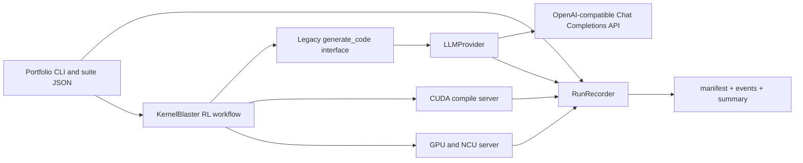

# Portfolio Architecture and API Configuration

Status at this commit:

- CUDA validation: **NOT RUN**
- LLM smoke test: **NOT RUN**
- Performance results: **pending**

The portfolio extension keeps the upstream optimization workflow intact and adds narrow boundaries around model access, run metadata, and suite execution.



## Provider boundary

`LLMProvider.generate(messages, model, n)` is the provider-neutral asynchronous interface. Existing agents continue calling `generate_code` and `generate_code_retry`; the query utility delegates remote requests to the configured provider.

The initial provider targets OpenAI-compatible **Chat Completions** endpoints. The model identifier is sent exactly as configured, so a gateway-specific GPT-5.6 alias can be used without hard-coded model validation. Responses-only endpoints are not supported in this phase.

Candidate fan-out is client-side. A request for `n=4` creates four independent `n=1` Chat Completions calls, bounded by `LLM_MAX_CONCURRENCY`. This avoids relying on third-party gateways to support the native `n` parameter.

Retryable failures include connection errors, timeouts, rate limits, HTTP 408/409, and 5xx responses. Authentication, permission, and ordinary bad-request failures are not retried. `LLM_MAX_REQUESTS` counts real API attempts, including retries. `LLM_MAX_TOTAL_TOKENS` stops new calls after reported or estimated usage reaches the limit; concurrent in-flight calls can make the final observed total slightly exceed that threshold.

## Environment configuration

Copy `.env.example` to a local `.env` and configure:

```bash
KERNELBLASTER_LLM_PROVIDER=openai_compatible
KERNELBLASTER_LLM_BASE_URL=https://your-gateway.example.com/v1
KERNELBLASTER_LLM_API_KEY=your-secret
MODEL=your-gateway-model-id
```

`KERNELBLASTER_LLM_API_KEY` falls back to the upstream-compatible `OPENAI_API_KEY`. Keys are never accepted as CLI arguments and are excluded from public provider configuration, manifests, and events. URLs written to artifacts exclude user information, query strings, and fragments.

Structured prompt events contain SHA-256, character count, and message count by default. Full prompt content is written only when `LLM_LOG_CONTENT=true` is explicitly set.

## Portfolio CLI

The CLI resolves a checked-in suite and applies optional runtime overrides:

```bash
python scripts/run_portfolio.py \
  --suite core10 \
  --model your-gateway-model-id \
  --gpu l40s \
  --rollouts 3 \
  --steps 3 \
  --output-dir out/portfolio/core10/example \
  --dry-run
```

`--dry-run` only validates suite paths and writes the three structured artifacts. It does not connect to an API, launch the CUDA servers, or execute a kernel. Omitting `--dry-run` is reserved for the later NVIDIA validation environment and requires an API key.

## Artifact contracts

- `run_manifest.json`: schema version, run ID, Git commit, selected model, non-secret provider settings, resolved suite, target GPU, host environment, and validation state.
- `events.jsonl`: append-only request, retry, compilation, correctness, profiling, and failure events. Every line includes a timestamp, run ID, sequence number, status, and optional task/rollout/attempt fields.
- `summary.json`: aggregate LLM requests, retries, usage, latency, CUDA activity, errors, and final run state.

Artifacts are stored below `out/` and intentionally ignored by Git. Selected, reviewed evidence will be published only after the deferred validation phase.
