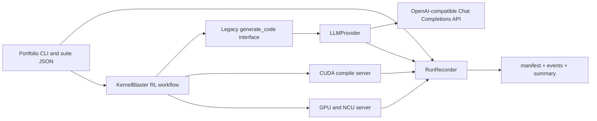
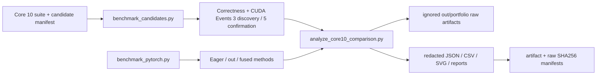
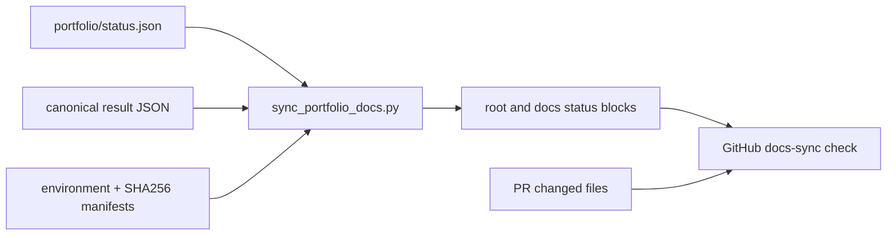

# Portfolio Architecture and API Configuration

**English** | [简体中文](architecture.zh-CN.md)

<!-- ARCHITECTURE_STATUS:START -->
Current measured state (2026-07-23):

- RTX 3080 / `sm_86` CUDA build, correctness, and CUDA Events: **completed**
- Same-GPU PyTorch eager/out/fused comparison: **completed**
- Historical v1 manual Core 10 strict verified improvements: **4/10**
- Full manual schema-v2 confirmation: **4 improved, 1 no improvement, 5 inconclusive**
- LLM live smoke: **failed: current HTTP 401 (1 request, 0 retries, 0 tokens; 2026-07-22)**; no Agent Core 10 search claim
- NCU counter attribution: **blocked by `ERR_NVGPUCTRPERM (non-root Docker/WSL; one no-network SYS_ADMIN retry also blocked; Windows native control passed)`**
- Cross-GPU comparison: **blocked by `requires authorized A100/L40S rental`**

Canonical status lives in `portfolio/status.json`; measured values are derived from the checked-in comparison JSON. `scripts/sync_portfolio_docs.py --check` rejects stale generated blocks and broken evidence links.
<!-- ARCHITECTURE_STATUS:END -->

The portfolio extension keeps the upstream optimization workflow intact and adds narrow boundaries around model access, run metadata, and suite execution.



## Provider boundary

`LLMProvider.generate(messages, model, n)` is the provider-neutral asynchronous interface. Existing agents continue calling `generate_code` and `generate_code_retry`; the query utility delegates remote requests to the configured provider.

The initial provider targets OpenAI-compatible **Chat Completions** endpoints. The model identifier is sent exactly as configured, so a gateway-specific GPT-5.6 alias can be used without hard-coded model validation. Responses-only endpoints are not supported in this phase.

Candidate fan-out is client-side. A request for `n=4` creates four independent `n=1` Chat Completions calls, bounded by `LLM_MAX_CONCURRENCY`. This avoids relying on third-party gateways to support the native `n` parameter.

Retryable failures include connection errors, timeouts, rate limits, HTTP 408/409, and 5xx responses. Authentication, permission, and ordinary bad-request failures are not retried. `LLM_MAX_REQUESTS` counts real API attempts, including retries. Before every request, the provider atomically reserves the conservative prompt estimate plus `LLM_MAX_COMPLETION_TOKENS` under a shared budget lock. A response settles that reservation against reported or estimated usage; failed calls release it. Concurrent requests therefore cannot collectively start after exceeding `LLM_MAX_TOTAL_TOKENS`. Optional `LLM_REASONING_EFFORT` is passed only to compatible model families.

## Environment configuration

Copy `.env.example` to a local `.env` and configure:

```bash
KERNELBLASTER_LLM_PROVIDER=openai_compatible
KERNELBLASTER_LLM_BASE_URL=https://your-gateway.example.com/v1
KERNELBLASTER_LLM_API_KEY=your-secret
MODEL=your-gateway-model-id
```

`KERNELBLASTER_LLM_API_KEY` falls back to the upstream-compatible `OPENAI_API_KEY`. Keys are never accepted as CLI arguments and are excluded from public provider configuration, manifests, and events. URLs written to artifacts exclude user information, query strings, and fragments.

Structured prompt events contain SHA-256, character count, and message count by default. Full prompt content is written only when `LLM_LOG_CONTENT=true` is explicitly set.

## Portfolio CLI

The CLI resolves a checked-in suite and applies optional runtime overrides:

```bash
python scripts/run_portfolio.py \
  --suite core10 \
  --model your-gateway-model-id \
  --gpu l40s \
  --rollouts 3 \
  --steps 3 \
  --output-dir out/portfolio/core10/example \
  --dry-run
```

`--dry-run` only validates suite paths and writes the three structured artifacts. It does not connect to an API, launch CUDA servers, query `nvidia-smi`, or execute a kernel. Omitting `--dry-run` requires a valid API key and a configured CUDA environment; the published Agent run remains blocked because the bounded live credential smoke returned 401.

## Artifact contracts

- `run_manifest.json`: schema version, run ID, Git commit, selected model, non-secret provider settings, resolved suite, target GPU, host environment, and validation state.
- `events.jsonl`: append-only request, retry, compilation, correctness, profiling, and failure events. Every line includes a timestamp, run ID, sequence number, status, and optional task/rollout/attempt fields.
- `summary.json`: aggregate LLM requests, retries, usage, latency, CUDA activity, errors, and final run state.

Artifacts are stored below `out/` and intentionally ignored by Git. Selected, reviewed evidence is published below `artifacts/portfolio-v1.0/`, with source and raw-file SHA256 manifests linking it back to append-only local runs.

## Correctness-first benchmark and analysis pipeline



`benchmark_cuda.py` compiles and runs original and launcher-normalized sources for correctness before timing. It removes only explicit host synchronization from the launcher, records both source hashes, calibrates inner loops, alternates AB/BA order, captures telemetry, and performs one cooldown/retest when Session spread exceeds 5%.

`benchmark_candidates.py` resolves `portfolio/case_studies/core10/candidates.json`, serializes all GPU work, retains failed or unstable candidates, and writes an incremental suite summary. `benchmark_pytorch.py` uses fresh processes per Session and exposes normal eager calls plus preallocated or fused alternatives where they materially change the comparison. `analyze_core10_comparison.py` keeps diagnostic medians separate from the strict fallback score.

## Candidate capability boundary

The Core 10 candidate manifest now uses schema 2.0. The standalone
`launch_gpu_implementation(void*, ...)` functions are private implementations;
the Python runner is the supported entry point because only it can validate
architecture, dtype, layout, stream, graph, direction, target dtype, and shape
metadata before compilation or CUDA initialization.

```bash
python scripts/benchmark_candidates.py \
  --task-id 036 \
  --describe-capabilities
```

Capability responses use the `KERNELBLASTER_CAPABILITY_JSON` marker. Exit code
0 means supported/describe, 2 means a malformed request or unknown task, and 5
means a well-formed but unsupported request. Rejections occur before the output
directory or any subprocess is created. The hardened 004/007/036/040/095
contracts are FP16 input with FP32 reference/accumulation, contiguous row-major,
legacy default stream, one stream, inference-forward only, no graph capture,
and no fallback. All other requests fail explicitly; none silently route to
PyTorch.

Canonical cases alone may enter the five-Session performance protocol. Edge
cases are correctness-only and run three seeds with five deterministic launches.
Mismatch, non-finite, mean, RMSE, and maximum errors cover every element;
p50/p90/p99/p99.9 use a recorded deterministic-stride sample capped at
1,048,576 elements per case. Aggregate quantiles are explicitly labeled as the
maximum per-case quantile envelope, rather than a pooled distribution. Task 007
keeps its very large upstream canonical baseline in the official driver and adds
a candidate-only three-seed/five-launch canonical driver. This satisfies the
strict candidate matrix without repeating the naive upstream 16K×16K path 15
times; boundary/odd/neighbor cases remain in the shared edge driver.

Tasks 007, 040, and 095 own cuBLAS/workspace state in per-host-thread,
per-CUDA-device RAII contexts. Their fixed contracts are respectively one
cuBLAS handle, 32,896 bytes, and 2,048 bytes; initialization occurs before
formal timing and thread teardown releases the resources. Dedicated GPU drivers
check five-call reuse, two simultaneous host threads on `cudaStreamLegacy`,
thread-exit cleanup, bounded steady-state device memory, and independent FP32
goldens. Release-build initialization/cleanup failures emit stable resource
markers that the runner maps to `blocked`; execution errors remain `failed`.
Profiler executables prewarm once before enabling collection. The manifest remains
`production_ready=false`: arbitrary dtype/layout, non-default or multiple
streams, CUDA Graph capture, backward, and arbitrary shapes are not supported.

Cross-GPU validation must be explicit. `--portability-replay-from sm_86 --sm
sm_80` labels an A100 run as `sm86_candidate_portability_replay_on_sm80`, forces
correctness-only execution, and does not expand the advertised sm_86 contract.

## Living documentation pipeline



The status manifest stores narrative state and repository-relative evidence paths; it does not duplicate performance values. `--write` renders marker-delimited English and Chinese summaries from canonical artifacts. `--check` verifies exact generated content, links, schemas, artifact hashes, and the absence of machine-specific absolute paths. With `--base-ref`, benchmark, candidate, or artifact changes must include README/docs or status changes in the same PR.
