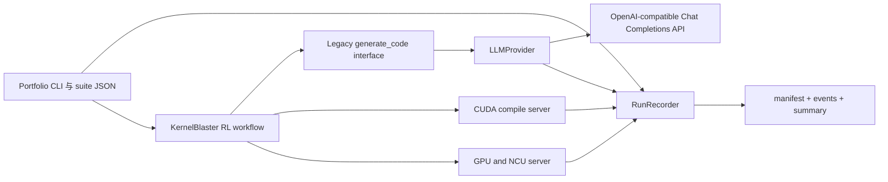
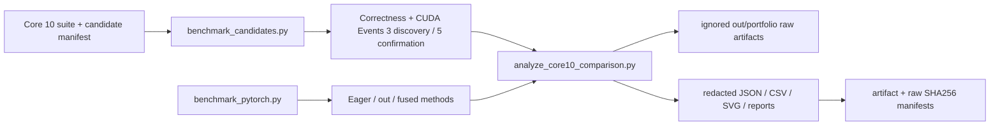
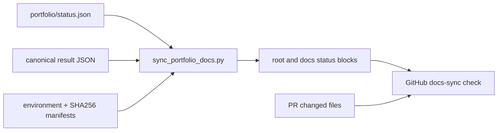

# Portfolio 架构与 API 配置

**简体中文** | [English](architecture.md)

<!-- ARCHITECTURE_STATUS:START -->
当前实测状态（2026-07-23）：

- RTX 3080 / `sm_86` CUDA 构建、正确性与 CUDA Events：**已完成**
- 同卡 PyTorch eager/out/fused 对比：**已完成**
- 历史 v1 手工 Core 10 严格验证提升：**4/10**
- Schema v2 完整手工确认：**4 项提升、1 项无提升、5 项无法定论**
- LLM 在线冒烟：**失败：当前 HTTP 401（1 次请求、0 次重试、0 tokens；2026-07-22）**；没有 Agent Core 10 搜索声明
- NCU 计数器归因：**受 `ERR_NVGPUCTRPERM (non-root Docker/WSL; one no-network SYS_ADMIN retry also blocked; Windows native control passed)` 阻塞**
- 跨 GPU 对比：**受 `requires authorized A100/L40S rental` 阻塞**

规范状态位于 `portfolio/status.json`；实测数值从已提交的对比 JSON 派生。`scripts/sync_portfolio_docs.py --check` 会拒绝过期的生成区块和失效的证据链接。
<!-- ARCHITECTURE_STATUS:END -->

该 Portfolio 扩展保留上游优化流程，并在模型访问、运行元数据和套件执行周围增加清晰的边界。



## Provider 边界

`LLMProvider.generate(messages, model, n)` 是与 Provider 无关的异步接口。现有 Agent 仍调用 `generate_code` 和 `generate_code_retry`；查询工具把远程请求委托给配置好的 Provider。

首阶段 Provider 面向 OpenAI 兼容的 **Chat Completions** 端点。模型标识符按配置原样发送，因此可以使用网关专用的 GPT-5.6 别名，不依赖硬编码的模型校验。本阶段不支持 Responses-only 端点。

候选 fan-out 在客户端完成。`n=4` 会创建四个独立的 `n=1` Chat Completions 请求，并由 `LLM_MAX_CONCURRENCY` 限制并发，避免依赖第三方网关是否支持原生 `n` 参数。

可重试失败包括连接错误、超时、限流、HTTP 408/409 和 5xx。认证、权限以及普通错误请求不重试。`LLM_MAX_REQUESTS` 统计包含重试在内的真实 API 尝试次数。每次请求前，Provider 在共享预算锁下原子预留保守的 prompt 估算量加 `LLM_MAX_COMPLETION_TOKENS`；响应完成后按报告或估算用量结算，失败请求释放预留。因此并发请求不会在超过 `LLM_MAX_TOTAL_TOKENS` 后集体启动。可选的 `LLM_REASONING_EFFORT` 只传给兼容的模型系列。

## 环境配置

将 `.env.example` 复制为本地 `.env` 并配置：

```bash
KERNELBLASTER_LLM_PROVIDER=openai_compatible
KERNELBLASTER_LLM_BASE_URL=https://your-gateway.example.com/v1
KERNELBLASTER_LLM_API_KEY=your-secret
MODEL=your-gateway-model-id
```

`KERNELBLASTER_LLM_API_KEY` 会回退到上游兼容的 `OPENAI_API_KEY`。Key 不接受 CLI 参数，也不会写入公开 Provider 配置、清单或事件。写入 artifact 的 URL 会移除用户信息、查询字符串和片段。

结构化 prompt 事件默认只包含 SHA-256、字符数和消息数。只有明确设置 `LLM_LOG_CONTENT=true` 时才写入完整 prompt 内容。

## Portfolio CLI

CLI 解析已提交的 suite，并应用可选的运行时覆盖：

```bash
python scripts/run_portfolio.py \
  --suite core10 \
  --model your-gateway-model-id \
  --gpu l40s \
  --rollouts 3 \
  --steps 3 \
  --output-dir out/portfolio/core10/example \
  --dry-run
```

`--dry-run` 只校验 suite 路径并写入三个结构化 artifact，不连接 API、不启动 CUDA Server、不查询 `nvidia-smi`，也不执行 kernel。省略 `--dry-run` 需要有效 API Key 和 CUDA 环境；由于受限凭据冒烟返回 401，已发布的 Agent 运行仍保持阻塞。

## Artifact 契约

- `run_manifest.json`：schema 版本、运行 ID、Git commit、所选模型、非秘密 Provider 设置、解析后的 suite、目标 GPU、主机环境和验证状态。
- `events.jsonl`：追加写入的请求、重试、编译、正确性、profile 和失败事件。每行都有时间戳、运行 ID、序号以及可选的 task/rollout/attempt 字段。
- `summary.json`：LLM 请求、重试、用量、延迟、CUDA 活动、错误和最终运行状态的汇总。

Artifact 存放于 `out/` 下，并有意被 Git 忽略。经过选择和审阅的证据发布在 `artifacts/portfolio-v1.0/`，通过源码和原始文件 SHA256 清单关联回本地追加运行。

## 正确性优先的基准与分析流水线



`benchmark_cuda.py` 在计时前编译并运行原始源码与启动器规范化源码的正确性测试。它只移除启动器中明确的主机同步，记录两套源码哈希，校准 inner loops，交替 AB/BA 顺序，采集遥测，并在 Session spread 超过 5% 时冷却后重测一次。

`benchmark_candidates.py` 解析 `portfolio/case_studies/core10/candidates.json`，串行执行全部 GPU 工作，保留失败或不稳定候选，并增量写入 suite summary。`benchmark_pytorch.py` 为每个 Session 使用新进程，并在确实改变比较含义时暴露普通 eager、预分配 out 和 fused 方案。`analyze_core10_comparison.py` 将诊断中位数与严格 fallback 分数分开。

## Candidate 能力边界

Core 10 candidate manifest 现使用 schema 2.0。独立的
`launch_gpu_implementation(void*, ...)` 只是私有实现；Python runner 才是受
支持的入口，因为只有它能在编译或 CUDA 初始化之前校验架构、dtype、布局、
stream、graph、方向、target dtype 与 shape 元数据。

```bash
python scripts/benchmark_candidates.py \
  --task-id 036 \
  --describe-capabilities
```

能力响应使用 `KERNELBLASTER_CAPABILITY_JSON` 标记。退出码 0 表示支持或查询
成功，2 表示请求格式错误或 task 未知，5 表示请求格式正确但能力不支持。
拒绝发生在创建输出目录或任何子进程之前。004/007/036/040/095 的 hardened
契约固定为 FP16 输入与 FP32 reference/累积、连续 row-major、legacy default
stream、单 stream、仅 inference-forward、不支持 graph capture、无 fallback。
其他请求均明确失败，不会静默回退到 PyTorch。

只有 canonical case 可以进入五 Session 性能协议。Edge case 仅验证正确性，
使用三个 seed，每个 seed 连续执行五次并要求确定性。mismatch、非有限值、
mean、RMSE 与最大误差覆盖全部元素；p50/p90/p99/p99.9 使用 artifact 中明确
记录的确定性等距采样，每个 case 最多 1,048,576 个元素。聚合分位数明确标记为
“各 case 分位数的最大包络”，而不是汇总分布。007 的超大 upstream canonical
baseline 继续由 official driver 验证，同时增加 candidate-only 的三 seed、五次连续
launch canonical driver。这样既满足候选严格矩阵，也避免将 naive upstream 16K×16K
路径重复 15 次；boundary/odd/neighbor 仍由共享 edge driver 覆盖。

007、040 与 095 使用按 host thread、按 CUDA device 所有的 RAII context 管理
cuBLAS/workspace。固定资源分别为一个 cuBLAS handle、32,896 bytes 与 2,048
bytes；资源在正式计时前初始化，并在线程退出时释放。专用 GPU driver 验证连续
五次复用、两个 host thread 在 `cudaStreamLegacy` 上同时调用、线程退出清理、
稳态显存有界以及独立 FP32 golden。Release 构建中的初始化/清理失败会输出稳定
resource marker 并由 runner 映射为 `blocked`；执行错误仍为 `failed`。Profiler
executable 会在开启采集前预热一次。Manifest 继续标记
`production_ready=false`：任意 dtype/layout、非默认或多 stream、CUDA Graph
capture、backward 与任意 shape 均不受支持。

跨 GPU 验证必须显式声明。`--portability-replay-from sm_86 --sm sm_80` 会把
A100 运行标记为 `sm86_candidate_portability_replay_on_sm80`，强制仅正确性
执行，并且不会扩大公开的 sm_86 能力契约。

## 持续文档流水线



状态清单保存叙述性状态和仓库相对证据路径，不重复性能数值。`--write` 从规范 artifact 生成带 marker 的英文和中文摘要；`--check` 校验生成内容、链接、schema、artifact 哈希，以及没有机器专属绝对路径。使用 `--base-ref` 时，基准、候选或 artifact 变化必须在同一 PR 中包含 README/docs 或状态变更。
