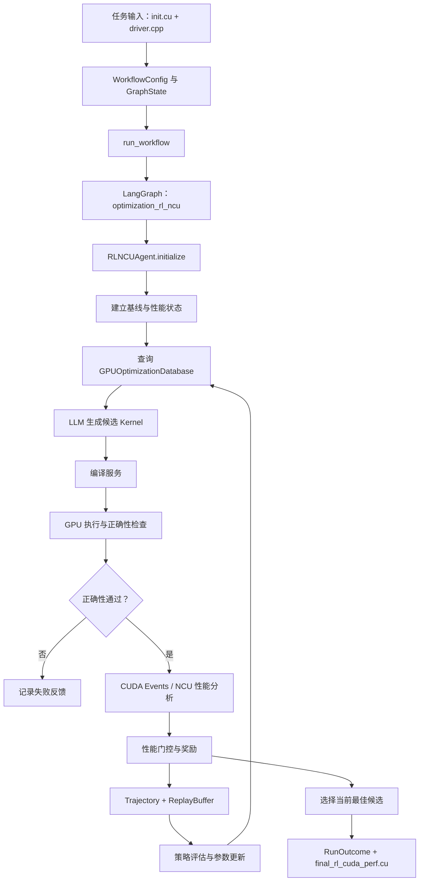

# KernelBlaster 核心源码阅读指南

本文面向已经掌握 Python 基础、了解 CUDA Kernel 和常见 GPU 性能概念的读者。目标不是逐个复述 API，而是回答三个更重要的问题：

1. 一个待优化的 CUDA Kernel 如何穿过整个系统？
2. 正确性、性能和 LLM 决策分别在哪一层被约束？
3. 阅读或修改核心代码时，应重点守住哪些不变量？

> 建议先阅读仓库根目录的 `README.zh-CN.md`，再按照本文给出的顺序进入源码。本文中的路径均相对于仓库根目录。

## 1. 一张图理解端到端流程



这条链路体现了项目最重要的原则：**候选必须先满足正确性约束，性能数字才有比较意义**。LLM 只负责提出候选和策略建议，不能绕过编译、运行、正确性或统计门控。

## 2. 推荐阅读顺序

### 第一阶段：先认识配置、状态和终态

按下面的顺序阅读：

1. `config/config.py`
   - `SystemConfig` 描述服务地址和全局运行环境。
   - `WorkflowConfig` 描述一次优化任务的模型、GPU、重试和 RL 参数。
2. `config/gpu_config.py`
   - 观察 GPU 名称如何被规范化为 `GPUType`。
   - 思考：未知 GPU 应该报错、降级，还是允许继续运行？
3. `graph/state.py`
   - `GraphState` 是工作流节点之间的共享协议。
   - `save_state_to_json` 会把不可直接序列化的对象转换为可持久化表示。
4. `outcomes.py`
   - `RunStatus` 和 `RunOutcome` 是跨模块传递的统一终态。
   - 注意“流程执行结束”和“找到更快候选”是两个不同概念。

这一阶段应建立以下认识：配置负责描述意图，状态负责传递过程数据，终态负责描述最终事实。

### 第二阶段：串起工作流骨架

阅读：

1. `workflow/workflow.py::run_workflow`
2. `graph/graph.py::build_graph`
3. `graph/nodes/optimization_rl_ncu.py::optimization_rl_ncu`

重点跟踪这些数据：

- `task_id`：一次任务的身份；
- `folder`：状态、日志和候选产物的落盘位置；
- `reference_code` / `user_message`：任务语义输入；
- `cuda_fp` / `test_code_fp`：候选源码和正确性 Driver；
- `shared_optimization_database`：可跨任务复用的优化经验；
- `run_outcome`：节点返回给顶层工作流的标准终态。

`run_workflow` 使用 `asyncio.wait_for` 施加顶层超时，并将异常、超时和普通失败统一转换为 `RunOutcome`。节点内部保存成功产物，顶层工作流负责兜底写入失败标记。

### 第三阶段：理解 RL 优化循环

核心文件是：

- `agents/opt_ncu_rl.py`
- `agents/rl_agents.py`
- `agents/feedback.py`
- `agents/database.py`
- `agents/reprofile.py`

建议以 `RLNCUAgent.initialize` 和 `RLNCUAgent.run` 为入口，沿调用关系阅读，而不是从文件第一行顺序读到最后一行。

#### 3.1 状态、动作与奖励

这里的“强化学习”不是一个独立训练出的神经网络策略，而是由以下组件共同形成的闭环：

- 性能分析结果描述当前硬件状态和瓶颈；
- 优化数据库提供历史上对相似状态有效的动作；
- LLM 将策略和上下文转换为候选 CUDA 代码；
- 编译、正确性测试和 Profiler 产生真实反馈；
- 轨迹与 Replay Buffer 保存历史尝试；
- 策略评估、性能差距分析和参数更新 Agent 调整下一轮决策。

阅读时要区分：

- `predicted_improvement`：策略选择阶段的预期收益；
- 实际 speedup：由真实测量得到的收益；
- reward：把正确性、性能和失败状态压缩为策略反馈的信号；
- confidence：数据库对某条历史经验可靠程度的估计。

#### 3.2 轨迹和经验回放

`agents/rl_agents.py` 中：

- `TrajectoryStep` 表示一次状态—动作—反馈；
- `Trajectory` 表示一个连续 rollout；
- `ReplayBuffer` 按容量保存最近轨迹；
- `PolicyEvaluationAgent` 总结已有策略的有效性；
- `PerfGapAnalysisAgent` 识别仍未解决的性能差距；
- `ParameterUpdateAgent` 把分析结果转换为数据库更新。

思考：如果只保留成功轨迹，系统会失去哪些信息？失败候选至少可以帮助系统避开无效策略、识别编译约束和估计某类优化的风险。

#### 3.3 优化知识库

`GPUOptimizationDatabase` 维护三层关系：

1. GPU/Kernel 的性能状态；
2. 状态下可采用的优化技术；
3. 历史使用次数、置信度、预测收益和实际收益。

阅读 `agents/database.py` 时建议重点关注：

- Markdown/JSON 数据如何载入并规范化；
- 状态相似度如何计算；
- 单项优化和组合优化如何评分；
- 实测结果如何反向更新置信度和预测值；
- 持久化前如何保持旧数据格式兼容。

这个文件较长，可以先读数据类，再读查询入口，最后阅读更新和序列化逻辑。

### 第四阶段：理解正确性优先的性能测量

核心文件：

- `benchmarking.py`
- `profiling.py`
- `agents/utils/commands.py`
- `agents/utils/annotate_ncu.py`
- `agents/utils/parsing.py`

#### 4.1 Driver 插桩

`benchmarking.py` 负责识别 launch 声明和调用、拆分编译单元，并生成用于 CUDA Events 或 NCU 的 Driver 变体。源码解析主要依赖平衡括号和受控文本扫描，而不是完整的 C++ AST，因此修改时必须考虑：

- 模板参数和嵌套括号；
- 宏、命名空间和多行 launch；
- 声明与定义的区别；
- 不应修改用户 Kernel 的计算语义。

#### 4.2 Profiler 抽象

`profiling.py` 用 `ProfilerBackend` 隔离分析方式：

- `EventsProfilerBackend` 使用 CUDA Events，开销较低，适合搜索阶段反复测量；
- `NCUFallbackProfilerBackend` 在需要硬件计数器或事件计时不可用时提供兼容路径；
- `ProfilingResult` 统一表达可用指标和错误原因。

`evaluate_performance_gate` 不只比较两个中位数，还会检查配对样本、Bootstrap 置信区间和会话稳定性。这样可以降低偶然抖动被误判为优化的概率。

#### 4.3 正确性指标

`servers/cuda_env/correctness_metrics.h` 定义数值比较使用的指标。阅读时关注：

- 绝对误差与相对误差在接近零时的行为；
- NaN、Inf 和不同数据类型的处理；
- 归一化分母是否可能过小；
- 阈值是否与任务的数据规模和精度相匹配。

性能更快但数值不可信的候选必须被拒绝，不能进入性能排名或知识库正向更新。

### 第五阶段：理解编译与 GPU 服务

核心文件：

- `servers/compile.py`
- `servers/gpu.py`
- `servers/management.py`
- `servers/security.py`
- `servers/auth.py`
- `resources/servers.py`

编译与 GPU 执行被拆成服务，是为了隔离工具链、控制 GPU 并发并限制不可信候选代码的执行边界。

#### 5.1 编译服务

`servers/compile.py` 的主要职责：

- 为请求分配可复用或临时 CUDA 构建环境；
- 生成 CMake 命令并收集 include 路径；
- 通过队列限制并发编译；
- 把编译成功、失败和服务异常统一写回请求 Future；
- 在服务退出时清理 Worker 和环境。

#### 5.2 GPU 服务

`servers/gpu.py` 的主要职责：

- 限制上传大小和临时文件范围；
- 只允许受控环境变量进入子进程；
- 为不同 GPU Worker 建立串行执行队列；
- 处理超时、进程终止、stdout/stderr 和临时文件清理；
- 防止多个测量任务在同一 GPU 上相互干扰。

安全边界分散在参数校验、路径校验、环境变量白名单、Token 和子进程生命周期中。不要把其中任何单点当作完整沙箱。

### 第六阶段：LLM、可观测性和 Portfolio

#### 6.1 LLM Provider

阅读：

- `llm/base.py`
- `llm/factory.py`
- `llm/openai_compatible.py`
- `agents/utils/query.py`
- `agents/utils/local_llm.py`
- `agents/utils/batch_queue.py`

重点理解：

- Provider 如何统一远端 OpenAI 兼容接口；
- 候选并发、超时、重试与取消如何协作；
- token 用量和预算如何累计；
- 消息如何裁剪，代码块如何从模型响应中提取；
- 本地模型和远端模型如何共享上层调用约定。

#### 6.2 可观测性

`observability/recorder.py` 记录配置、事件、Prompt 元数据、Git 提交和源码树摘要。`redact_secrets` 在写盘前递归脱敏，`context.py` 使用上下文变量把记录器传入异步调用链。

可复现性依赖的不只是随机种子，还包括：源码版本、配置、模型、Prompt、输入任务、硬件环境和实际产物。排查问题时应先确认这些上下文是否完整。

#### 6.3 Portfolio

`portfolio/capabilities.py` 和 `portfolio/suite.py` 描述可复现任务集合。能力清单不是营销列表，而是运行前的约束边界：只有已声明的任务、实现、形状和数据类型才应进入受支持路径。

## 3. 关键数据结构速查

| 类型 | 位置 | 作用 | 阅读时关注 |
| --- | --- | --- | --- |
| `WorkflowConfig` | `config/config.py` | 单次任务的控制参数 | 默认值如何影响搜索成本 |
| `GraphState` | `graph/state.py` | 节点间共享状态 | 哪些字段可持久化、哪些仅运行时存在 |
| `RunOutcome` | `outcomes.py` | 标准终态 | 成功、无改进、失败和超时的区别 |
| `ProfilingResult` | `profiling.py` | 统一性能结果 | 分析模式、单位和错误状态 |
| `Trajectory` | `agents/rl_agents.py` | 一次 rollout 的历史 | 状态、动作、反馈是否完整 |
| `ReplayBuffer` | `agents/rl_agents.py` | 跨迭代经验 | 容量淘汰对策略偏差的影响 |
| `GPUOptimizationDatabase` | `agents/database.py` | 状态到优化经验的映射 | 相似度、置信度和持久化兼容 |
| `RunRecorder` | `observability/recorder.py` | 实验事件与证据 | 脱敏、原子写入和源码指纹 |

## 4. 输出目录与故障定位

典型任务目录会包含：

- `state.json`：工作流共享状态快照；
- `rl_ncu/`：RL Agent 的中间候选、日志和分析产物；
- `final_rl_cuda_perf.cu`：通过终态检查的最佳候选；
- `failed_rl_cuda_perf`：顶层工作流写入的失败原因；
- `.finished`：任务终态标记；
- 运行记录器生成的事件、配置和产物摘要。

推荐故障定位顺序：

1. 查看 `RunOutcome.status` 和 `reason`，确认是缺少输入、编译失败、正确性失败、性能未提升、超时还是基础设施故障。
2. 查看 `state.json`，确认任务实际使用的路径、GPU、模型和 RL 参数。
3. 若编译失败，检查拆分后的编译单元、CMake 命令和编译服务 stderr。
4. 若正确性失败，检查 Driver 输入、误差指标和特殊数值。
5. 若性能不稳定，检查会话样本、Profiler 模式、GPU 并发和系统抖动。
6. 若 LLM 阶段失败，检查预算、重试、响应代码块提取和脱敏后的请求元数据。

## 5. 修改核心代码时应守住的不变量

1. **正确性先于性能**：未通过正确性检查的候选不得获得正向性能奖励。
2. **单位必须显式**：cycles、微秒和秒不能隐式混用。
3. **终态必须收敛**：无论成功、异常、取消还是超时，队列 Future 和 `RunOutcome` 都应结束。
4. **状态必须可恢复**：写盘对象需要可序列化，关键文件尽量原子替换。
5. **候选代码不可信**：路径、环境变量、命令参数和上传大小必须受限。
6. **统计比较需要同源样本**：基线和候选应在可比较的会话与设备条件下测量。
7. **经验更新必须区分预测和实测**：不能用模型自评替代真实 speedup。
8. **日志不得泄密**：API Key、Token 和认证头在写盘前必须脱敏。

## 6. 建议的源码思考题

### 工作流与状态

- 当前 Graph 只有一个主要优化节点，引入多节点并行时，哪些 `GraphState` 字段会发生写冲突？
- 顶层超时触发后，底层编译或 GPU 子进程是否一定被终止？证据在哪些函数中？
- `RunOutcome.NO_IMPROVEMENT` 与 `FAILED` 对调用方和后续统计分别意味着什么？

### RL 与知识库

- Replay Buffer 使用“最近经验”时，会不会过度遗忘早期但稀有的有效策略？
- 相似状态检索中，哪些硬件指标应该具有更高权重？权重能否跨 GPU 复用？
- 组合优化的收益是否可以由单项优化收益简单推断？哪些 CUDA 优化会相互冲突？
- 数据库更新如何避免一次噪声测量显著改变长期置信度？

### 性能与正确性

- 为什么只比较单次最快延迟会产生系统性偏差？
- Bootstrap 下界、会话中位数和波动阈值分别过滤哪一类假优化？
- 对 FP16/BF16、归约和包含 NaN 的任务，统一误差阈值是否合理？
- CUDA Events 和 NCU 的测量开销、同步语义及适用阶段有什么差异？

### 服务与安全

- 如果 GPU Worker 在设置 Future 结果前崩溃，调用方如何退出等待？
- 环境变量白名单能防止哪些风险，又不能防止哪些风险？
- 临时文件清理发生异常时，是否会掩盖原始编译或执行错误？
- Bearer Token、路径白名单和子进程隔离之间是什么关系？

### LLM 与可复现性

- 并发请求返回顺序变化是否会改变候选选择结果？
- token 估算与服务端实际计费不一致时，预算控制应以谁为准？
- 保存完整 Prompt 有助于复现，但也增加泄密风险；当前脱敏边界是否充分？
- 同一配置在模型服务升级后能否严格复现？还需要记录哪些服务端信息？

## 7. 常用验证入口

在仓库根目录执行：

```bash
# 运行 CPU 测试
python -m pytest -q

# 编译检查所有 Python 源码
python -m compileall -q src scripts

# 执行仓库配置的基础静态检查
ruff check .
```

进一步阅读测试时，建议从以下目录开始：

- `tests/benchmarking/`：Driver 插桩、正确性门控和性能统计；
- `tests/llm/`：OpenAI 兼容 Provider 的重试、预算和并发行为；
- `tests/observability/`：脱敏与运行记录；
- `tests/portfolio/`：能力清单和资源生命周期；
- `tests/security/`：Worker 认证、环境变量和路径约束。

## 8. 术语表

- **Candidate（候选）**：LLM 或其他策略生成、等待验证的 CUDA 实现。
- **Baseline（基线）**：用于正确性或性能比较的参考实现与测量结果。
- **Rollout（轨迹展开）**：Agent 从初始状态连续选择动作并接收反馈的过程。
- **Replay Buffer（经验回放缓冲区）**：保存历史轨迹、供后续策略分析复用的有限容量存储。
- **Profiler（性能分析器）**：采集延迟、周期或硬件计数器的组件。
- **Performance Gate（性能门控）**：结合正确性、统计结果和稳定性决定候选是否可接受的规则。
- **NCU**：NVIDIA Nsight Compute，用于采集 CUDA Kernel 硬件性能指标。
- **CUDA Events**：GPU 时间线上的事件计时机制，适合低开销延迟测量。
- **Portfolio**：项目声明并持续验证的一组可复现任务、能力和证据。

读完本指南后，建议选择一个小型 KernelBench-CUDA 任务，从 `run_workflow` 开始手工记录每次函数跳转、状态字段变化和落盘产物。完成一次真实调用链追踪，比孤立阅读每个类更容易建立稳定的系统心智模型。
